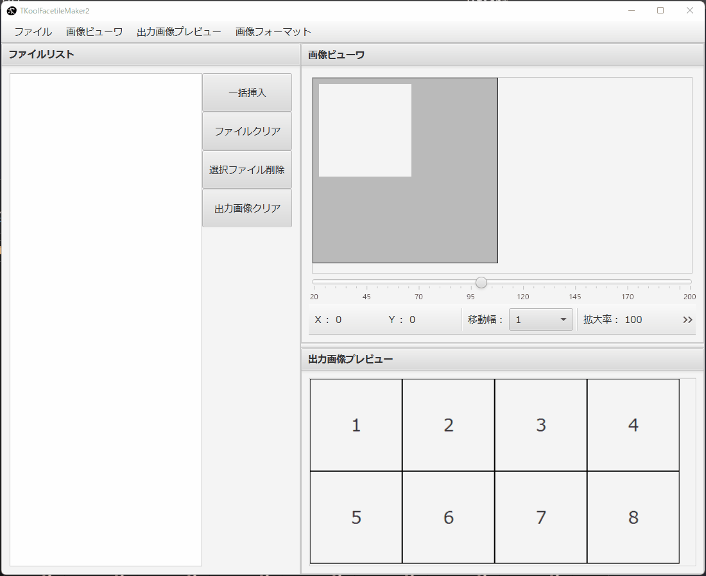

= TKoolFacetileMaker2
:toc: left
:sectnums:

image:https://github.com/jiro4989/TKoolFacetileMaker2/workflows/build/badge.svg[build, link=https://github.com/jiro4989/TKoolFacetileMaker2/actions]
image:https://codecov.io/gh/jiro4989/TKoolFacetileMaker2/branch/master/graph/badge.svg[codecov, link=https://codecov.io/gh/jiro4989/TKoolFacetileMaker2]

== 概要

このソフトは、RPGツクールMZ・MV・VXACEの表情差分ファイルを効率的に作成するための
ソフトです。

立ち絵の差分を持っている、あるいは描いたけれど、それをツクール規格に合わせるの
が面倒という方の助けになります。立ち絵の差分画像をツクール規格に合わせる場合、
トリミングする位置は同じで、対象画像だけが異なる場合が多いです。このケースでは
本ツールでまとめて同じ位置でトリミングをすることが可能です。

簡易ですが画像の拡大縮小もできるので、ペイントソフトをいちいち開いたりしなくて
よいソフトです。

また、MZ,MV,VXACEと記載しているとおり、MZ,MV,VXACE両方の規格に合わせて出力するこ
とが可能になっています。

== インストール

https://github.com/jiro4989/TKoolFacetileMaker2/releases[Releases]から各プラッ
トフォーム向けの圧縮ファイルをダウンロードして展開する。
圧縮ファイル内にはいくつかファイルがあるが、これらはセットで必要。任意のフォル
ダなどに移動したい場合は、展開したフォルダごと移動すること。

== 起動手順

. (Windows) tkfm.batをダブルクリックする
.. このとき警告が出る場合があるけれど、許可する
.. 黒いウィンドウが表示されるが、閉じないで待つ
.. GUIの画面が表示される
. (Mac/Linux) tkfmを実行する

== 使い方

=== 基本的な使い方

1. ひとつのファイルにまとめたい表情差分をインポートします。画面左上のメニューの
   開くからまとめたいファイルを選択してください。画面左側のリストにファイル名が
   追加されていれば正常にインポートが完了しています。このファイルの追加はドラッ
   グアンドドロップでも行えます。

2. ファイルリストをクリックしてください。ファイルリストをクリックすると、画面右
   側の画像ビューワに選択した画像が表示されます。

3. 画像ビューワ中央のグリッドをマウスドラッグで移動してください。位置調整はキー
   ボードからも行えます。上下左右移動はWASD, 拡大率の調整はQ, Eで行えます。ま
   た、移動量や拡大率の増減量は、画像ビューワ下のコンボボックスで調節できます。

4. 位置が決まったら、パネルをクリックするか、一括挿入ボタンをクリックしてくださ
   い。一括挿入はキーボードからも行えます。数字キーを押していただくと、押した数
   字に対応したパネルから一括挿入がされます。

5. これでOKだと思うように調整できましたら、メニューから保存を選択してください。
   正常に保存されていることが確認できれば、作業は終了です。お疲れ様でした。

=== ユーザ独自の画像フォーマットの追加

ツクール以外のソフト用に独自のタイル画像を生成することが可能です。

まず、RPGツクールの画像フォーマットは以下のとおりです。

|==================
| ツクール | 行数 | 列数 | 1タイルあたりの横幅 px | 1タイルあたりの縦幅 px

| MV / MZ | 2 | 4 | 144 | 144
| VXACE | 2 | 4 | 96 | 96
|==================

上記の2つの画像フォーマットは本ツールに組み込まれた標準フォーマットですが、ユー
ザ独自の画像フォーマットを追加できます。

以下の手順を実施します

1. メニューバーの「画像フォーマット」を選択する

2. 「画像フォーマットを追加」を選択する

3. フォームに入力する

4. OKボタンを押す

これでメニューバーに新しくユーザ独自の画像フォーマットが追加されます。
ユーザが独自に追加した画像フォーマットは次回起動時も保持されます。

画像フォーマットは追加と削除の操作しかできません。
追加したあとで設定を変更したくなった場合は、削除してから設定を作り直してください。

=== ショートカットキー

[options="header"]
|=========
|キー|説明
|W|プレビューの画像を上にずらす。
|A|プレビューの画像を左にずらす。
|S|プレビューの画像を下にずらす。
|D|プレビューの画像を右にずらす。
|Q|プレビューの画像を縮小。
|E|プレビューの画像を拡大。
|1|プレビューパネルの1番からファイルを一括挿入する。
|2|プレビューパネルの2番からファイルを一括挿入する。
|3|プレビューパネルの3番からファイルを一括挿入する。
|4|プレビューパネルの4番からファイルを一括挿入する。
|5|プレビューパネルの5番からファイルを一括挿入する。
|6|プレビューパネルの6番からファイルを一括挿入する。
|7|プレビューパネルの7番からファイルを一括挿入する。
|8|プレビューパネルの8番からファイルを一括挿入する。
|=========

== アンインストール

フォルダごと削除する。

== 連絡先

バグ報告、機能要望、質問などがあれば、リポジトリのissuesに起票ください。

それ以外については、以下に連絡ください。

https://twitter.com/jiro_saburomaru[@jiro_saburomaru]

== LICENSE

GPL-2.0

== 開発者向け

=== 前提条件

* Java 16
* Ubuntu 20.04

以下のインストールスクリプトを実行すると環境が整う。

[source,bash]
----
./script/install_java.sh
----

実行したら環境変数 `JAVA_HOME` を設定すること。

=== ビルド手順

以下のコマンドを実行する。

[source,bash]
----
./gradlew build
----

上記ビルド時に単体テストも同時に実行されるが、
テストはスキップしてビルドしたい場合は以下コマンドを実行する。

単体テスト時にGUI環境が求められるため、WSL2環境でGUI環境を整えていない場合などは、
単体テストに失敗する。

[source,bash]
----
./gradlew build -x test
----

コードフォーマットを適用する場合は以下のコマンドを実行する。
これは build 時にも自動で実行されるため、明示的に実行する必要は本来無いが、念の
為。

[source,bash]
----
./gradlew spotlessApply
----

コードフォーマットをチェック場合は以下のコマンドを実行する。

[source,bash]
----
./gradlew spotlessCheck
----

=== アプリ起動手順

前述のビルドコマンドを実行後に以下のコマンドを実行する。

実行する前提条件として、下記スクリプトにかかれている `module-path`
のパスにJavaFX SDKがインストールされている必要がある。 JavaFX SDKは
https://gluonhq.com/products/javafx/[JavaFXのサイト]
からSDKをダウンロードしてきて圧縮ファイルを展開して配置する。

[source,bash]
----
./gradlew clean build runApp
----

=== カスタムJREの作成手順

以下のコマンドを実行する。成果物としてjreディレクトリが作成される。

アプリが依存しているモジュールは `modules.txt`
に記載。ここに追記するとスクリプトにも反映される。

実行する前提条件として、前述のJavaFXのサイトにて配布されているJMODSが必要。
こちらをダウンロードしてきて、 `./jmods/javafx-jmods-11.0.2` に配置する。

配置後に以下のコマンドを実行する。

[source,bash]
----
./gradlew jlink
----

=== カスタムJREを使用してアプリを起動する手順

以下の手順を実施する。

* ビルド手順
* カスタムJRE作成手順

実施の後、以下のコマンドを実行する。

[source,bash]
----
./jre/bin/java -jar build/libs/tkfm-dev.jar com.jiro4989.tkfm.Main
----

これで起動しなければ何かがおかしい。

=== リリース手順

gitのタグを打つとリリースされる。
以下のコマンドを実行する。

[source,bash]
----
# タグを確認
git tag

# 新しいタグを付与
git tag {新しいタグ}
----
